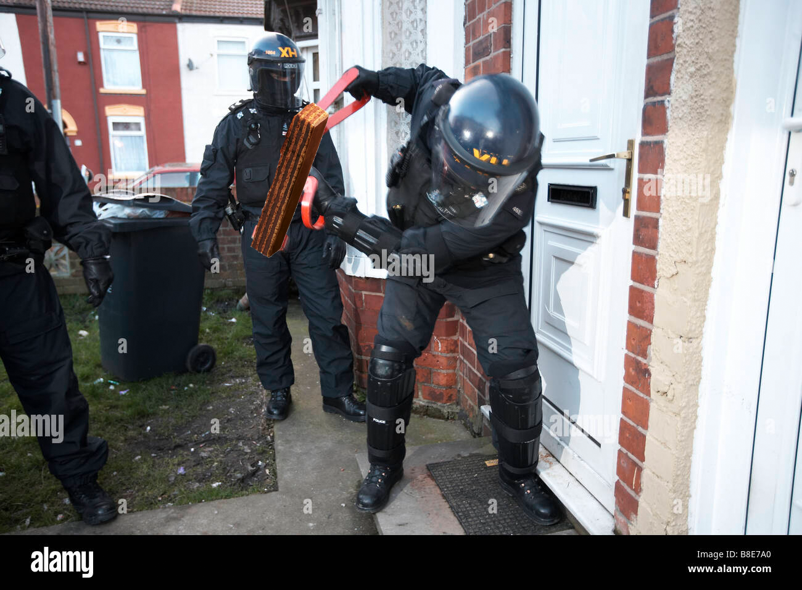

# Attack strategy

Our attack strategy can be summarized as following. First, we used an incremental approach with various tools in order to test the resiliency of the enemy defences. In this phase, we used:

- GoldenEye
- Targa3
- SlowLoris

We tested some attacks at low-medium intensity, then others at a slightly higher intensity. These tools did not allow spoofing: after some mere seconds, the enemy team had already blacklisted the two non-legitimate IPS.

Then, as we concluded that our efforts were not strong enough and we needed to spoof in order to do something, we took out our most powerful weapon and started to bomb the enemy link with a powerful DDoS attack. Our weapon was a `loacker` wafer:



```plaintext
sudo ./tools/loacker/loacker 10.1.4.2
```

We managed to saturate the gateway-server link and the router's buffers for half an hour, until the blue team managed to fix the problem. During this period, all requests either timed out (`120s`)or returned way too late (upwards of `800s`).

After a brief recovery time, their server was back online serving requests, although not in a very consistent manner. Again, we tried to attack indiscriminate attacks with spoofing, both with `loacker` and `hping3`. However, the attacks were not fully successful as the last time. The server started behaving erratically - at least from our side - some responses were blazing fast, others took tens of seconds, others disappeared into oblivion and resurfaced after several minutes. We were not able to pinpoint the cause of the problem. At this time, we decided to fully crank out our attacks and tried a combination multi-threaded `hping3` and `Hulk` attacks.

```plaintext
sudo hping3 -p 80 -S --flood 10.1.5.2 -y --tcp-timestamp -a client2 & \
sudo hping3 -p 80 -S --flood 10.1.5.2 -y --tcp-timestamp -a client2 & \
sudo hping3 -p 80 -S --flood 10.1.5.2 -y --tcp-timestamp -a client2 & \
sudo hping3 -p 80 -S --flood 10.1.5.2 -y --tcp-timestamp -a client2 
```

This approach worked until the end of the first segment of the CTF. At the end, we relied on the fact that the router was probably so much overloaded with requests, that even stopping all the attacks would have required several minutes of truce before cleaning up all links for good.